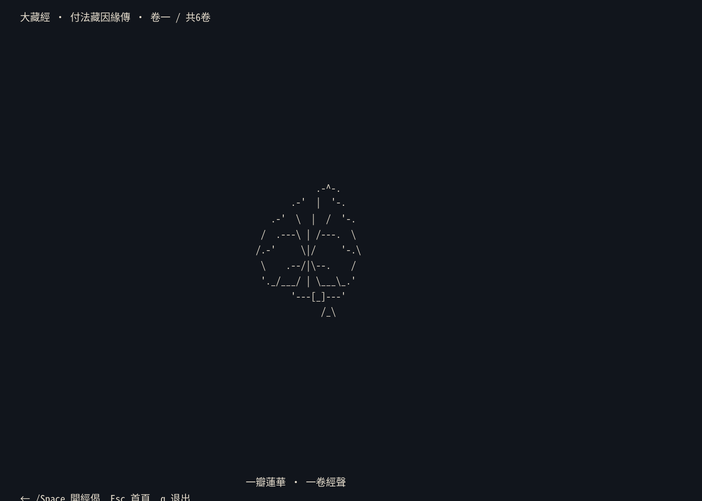
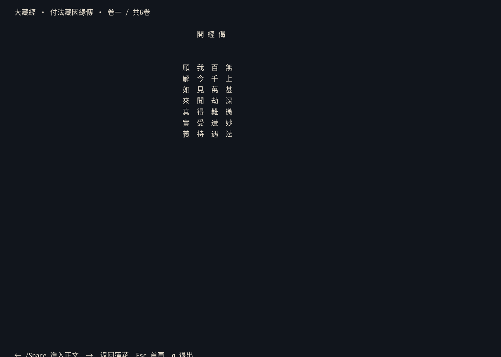
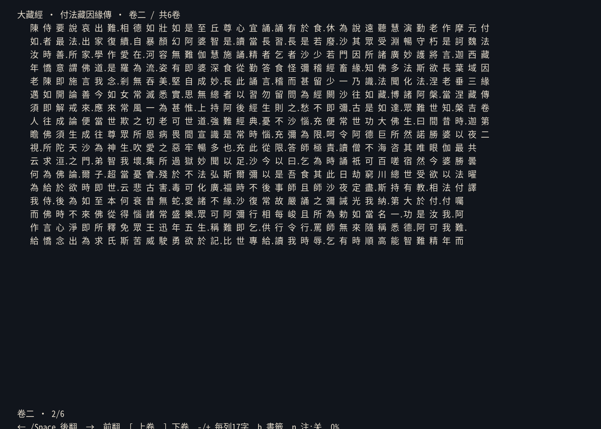
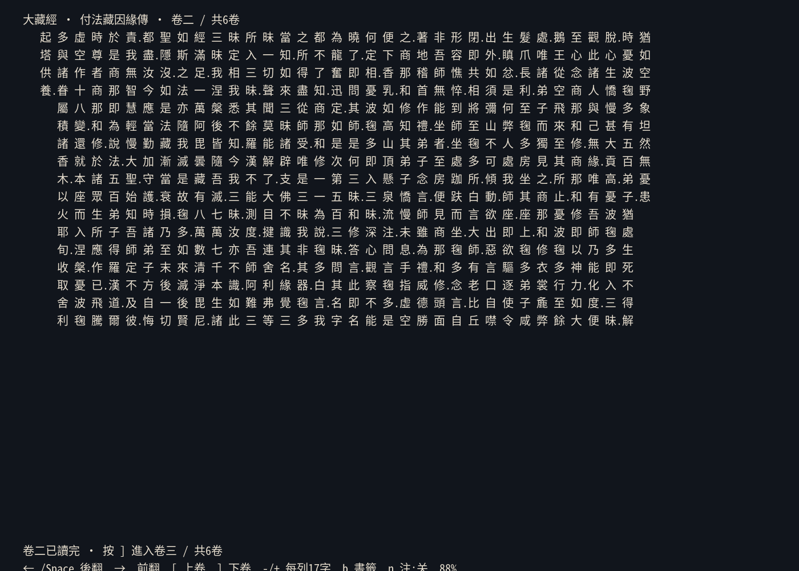

# tripitaka-cli

原生终端竖排 CBETA 大藏经阅读器。正文列内自上而下，列序自右向左；排版单位是终端字符格，不依赖浏览器、CSS 或图像协议。

## 界面

<p align="center">
  
  
  
  
</p>

## 当前状态

首个可运行骨架已包含：

- 读取 `guyiicn/tripitaka` 数据管线生成的紧凑 JSON v2
- 固定列高的右起竖排与响应式分页
- CBETA 句号、读号在正文右侧的朱色行间旁标
- 卷/品题和序题独立成列
- 原始段落提行
- 夹注可开关的可读降级显示
- 以源字符索引为锚点，改变列高或终端尺寸后保持位置
- 默认首页：最近阅读、书签与搜索入口
- 繁体、简体、拼音/首字母、经号搜索
- SQLite 自动阅读进度与书签；从搜索结果再次打开时自动续读
- 多卷经文提示与 `[` / `]` 切卷；每卷分别恢复阅读位置
- 莲花、开经偈与全经读毕后的回向偈虚拟页面（不改动 CBETA 正文）

## 运行

需要 Go 1.25+ 与 UTF-8 终端：

```sh
go run ./cmd/tripitaka-cli ./testdata/T0251_001.json

# 完整目录/数据目录模式（默认读取 local-data/catalog.json）
go run ./cmd/tripitaka-cli --data ./local-data
```

## 准备经文数据

本仓库只发布阅读器代码，**不附带经文数据**。程序不能直接读取 CBETA XML、原始 TXT
或 Android 版的 `tripitaka.db`，需要使用
[`guyiicn/tripitaka`](https://github.com/guyiicn/tripitaka) 的
[`pipeline/cbeta_prep.py`](https://github.com/guyiicn/tripitaka/blob/main/pipeline/cbeta_prep.py)
将 CBETA 纯文本转换为紧凑 JSON v2。

生成后的可用数据目录必须是下面的结构：

```text
local-data/
├── catalog.json
├── T0251/
│   ├── _meta.json
│   └── 001.json
└── T2058/
    ├── _meta.json
    ├── 001.json
    ├── 002.json
    └── ...
```

其中 `catalog.json` 是全局目录；每部经的 `_meta.json` 记录卷号；`001.json` 等文件是
各卷正文。数据放好后运行：

```sh
go run ./cmd/tripitaka-cli --data ./local-data
```

也可先验证一卷是否为正确格式，不进入交互界面：

```sh
go run ./cmd/tripitaka-cli --check ./local-data/T2058/001.json
```

若生成目录将 `catalog.json` 与 `data/` 分开放置，无需复制文件，可分别指定：

```sh
go run ./cmd/tripitaka-cli \
  --data /path/to/generated/data \
  --catalog /path/to/generated/catalog.json
```

原始经文请从 [CBETA 官方资源](https://www.cbeta.org)取得。经文不受本仓库 MIT
许可证覆盖；使用及再分发时须遵守
[CBETA 版权声明](https://www.cbeta.org/copyright)。

先做非交互数据检查：

```sh
go run ./cmd/tripitaka-cli --check ./testdata/T0251_001.json
```

按键：

- `←`、`Space`、`PageDown`、`l`：向后翻页（版面向左推进）
- `→`、`PageUp`、`h`：向前翻页
- `[` / `]`：上一卷/下一卷
- `-` / `+`：减少/增加每列字数
- `n`：切换夹注
- `g` / `G`：篇首/篇末
- `q`：退出
- 首页：`/` 搜索，`r` 全部进度，`b` 全部书签
- 阅读页：`b` 保存当前位置书签，`Esc` 返回首页

## 设计约束

终端没有 CSS 的半个汉字宽度，因此 Web 版“双行夹注”不能在普通字符终端中等比复刻。当前将夹注以青色 `〔…〕` 插入字格流；后续可为 Kitty/Sixel 添加图形精排后端，但纯字符后端始终可用。

数据不提交到本仓库。程序代码与 CBETA 经文数据应分别授权和发布。
